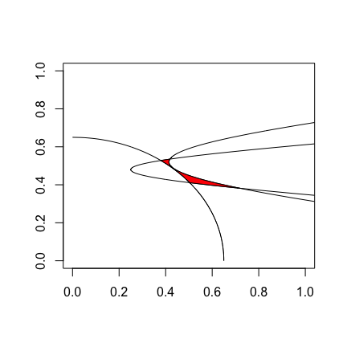
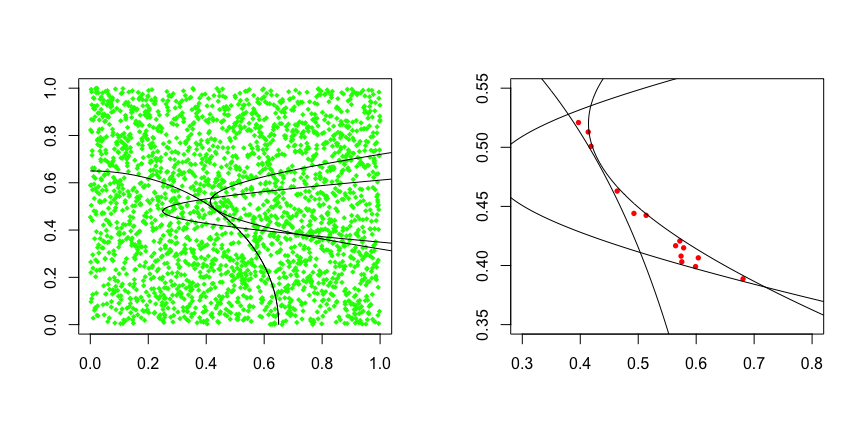
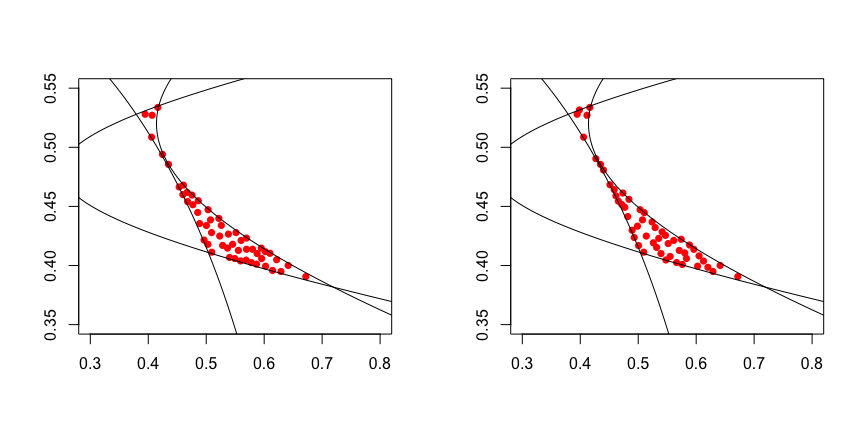
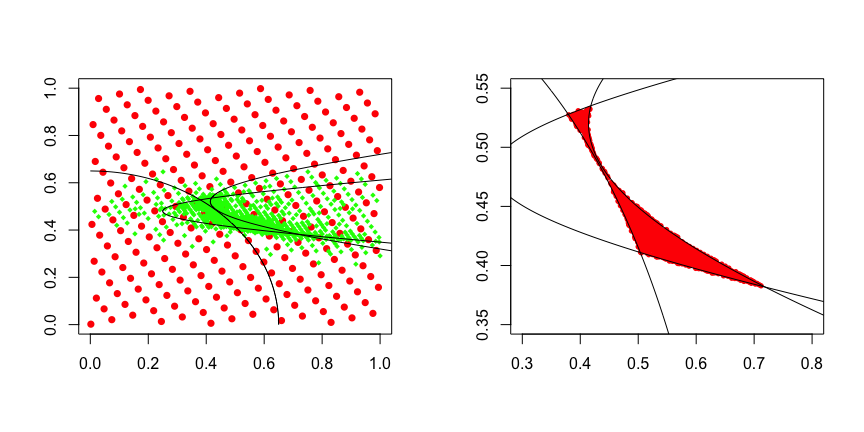
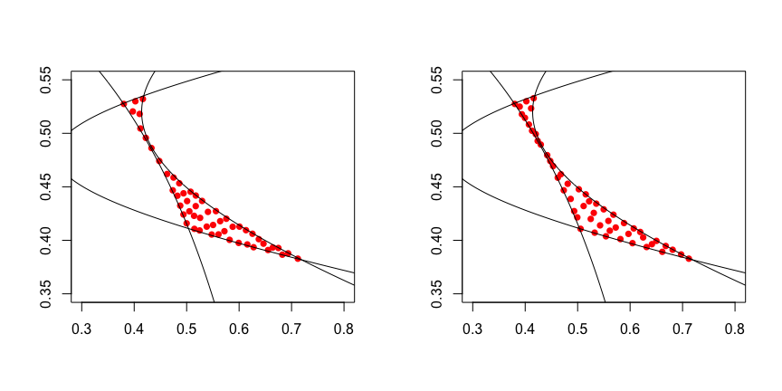
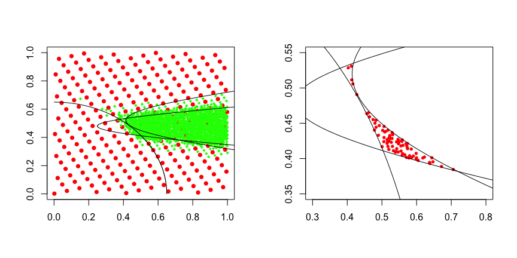
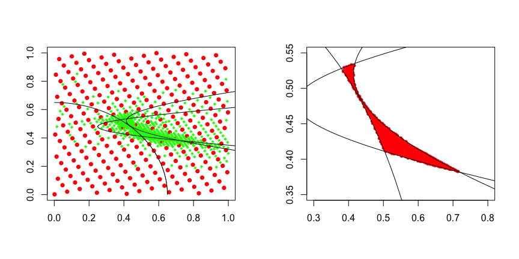

Contrained Minimum Energy Designs (CoMinED)
================
Chaofan (Bill) Huang

This tutorial discusses several techniques to construct space filling
design in any constrained region, including our recent proposed method,
Costrained Miminum Energy Designs (CoMinED). Let us first load the
required library and scripts.

``` r
source("scripts/lib.R")
```

Let us look at a motivation example defined by three nonlinear
inequality constraints.

``` r
# define motivation example
constraint <- function(x){
  c1 <- (x[1] - sqrt(50 * (x[2] - 0.52)^2 + 2) + 1)
  c2 <- (sqrt(120 * (x[2] - 0.48)^2 + 1) - 0.75 - x[1])
  c3 <- (0.65^2 - x[1]^2 - x[2]^2)
  return (c(c1,c2,c3))
}
# define constraint contour
x1 <- x2 <- matrix(NA, nrow = 3, ncol = 1001)
x2.seq <- seq(0,1,length.out = 1001)
x2[1,] <- x2.seq
x1[1,] <- sqrt(50 * (x2.seq - 0.52)^2 + 2) - 1
x2[2,] <- x2.seq
x1[2,] <- sqrt(120 * (x2.seq - 0.48)^2 + 1) - 0.75
x2[3,] <- x2.seq
x1[3,] <- sqrt(0.65^2 - x2.seq^2)
contour <- list(x1 = x1, x2 = x2)
# plot feasible region
plot(NULL, type = 'n', xlim = c(0,1), ylim = c(0,1), ylab = "", xlab = "")
for (i in 1:3) lines(contour$x1[i,], contour$x2[i,])
polygon(x = c(contour$x1[1,383:536], contour$x1[2,536:529], 
              contour$x1[3,529:412], contour$x1[2,412:383]),
        y = c(contour$x2[1,383:536], contour$x2[2,536:529], 
              contour$x2[3,529:412], contour$x2[2,412:383]),
        col = "red")
```

<!-- -->

``` r
# estimate the feasibility ratio by quasi-random points
samp <- sobol(1e4, 2)
samp.gval <- t(apply(samp, 1, constraint))
samp.out <- apply(samp.gval, 1, function(x) any(x>0))
feas.ratio <- 1 - sum(samp.out) / 1e4
feas.ratio
```

    ## [1] 0.0052

The feasibility ratio of the motivation example is only 0.52%.

## One-Step Acceptance/Rejection Sampling

Let us now perform the one-step accepetance/rejection sampling on the
Latin Hypercube samples.

``` r
library(lhs)
set.seed(20210329)
lhs.all <- randomLHS(2385, 2)
lhs.gval <- t(apply(lhs.all, 1, constraint))
lhs.out.idx <- apply(lhs.gval, 1, function(x) return(any(x>0)))
lhs.feasible <- lhs.all[!lhs.out.idx,]
nrow(lhs.feasible) # number of feasible samples
```

    ## [1] 14

``` r
# visualization
layout(matrix(c(1:2), nrow = 1, byrow = T))
# all Latin Hypercube Samples
plot(lhs.all, col = "green", pch = 18, cex = 0.75, 
     xlim = c(0,1), ylim = c(0,1),xlab = "", ylab = "")
for (i in 1:3) lines(contour$x1[i,], contour$x2[i,])
# only feasaible Latin Hypercube Samples
plot(lhs.feasible, col = "red", pch = 16, cex = 0.75, 
     xlim = c(0.3,0.8), ylim = c(0.35,0.55), xlab = "", ylab = "")
for (i in 1:3) lines(contour$x1[i,], contour$x2[i,])
```

<!-- -->

Left panel shows 2385 randomized Latin hypercube samples from the unit
hypercube. Right panel shows the 14 feasible candidate samples after
applying acceptance/rejection sampling. This shows that the one-step
acceptance/rejection approach is inefficient, especially when the
feasibility ratio is very small.

## Adaptive Sequentially Constrained Monte Carlo

Next, let us apply the adaptive Sequentially Constrained Monte Carlo
(SCMC) to the motivation problem with M = 265 samples per step and
rigidity parameters defined below in the code. Thus, total of 2385
samples are used, so we can have a direct comparison to the one-step
acceptance/rejection sampling approach.

``` r
set.seed(20210329)
tau <- c(0,exp(c(1:7)),1e6)
scmc.samp <- scmc(265, 2, tau, constraint, auto.scale = F, return.all = T)
nrow(scmc.samp$samp.all) # number of total samples
```

    ## [1] 2385

``` r
nrow(scmc.samp$samp.feasible) # number of feasible samples
```

    ## [1] 1205

``` r
# visualization
layout(matrix(c(1:2), nrow = 1, byrow = T))
# all scmc samples
scmc.all <- scmc.samp$samp.all
plot(scmc.all[1:265,], col = "red", pch = 16, cex = 1, 
     xlim = c(0,1), ylim = c(0,1),xlab = "", ylab = "")
points(scmc.all[266:nrow(scmc.all),], col = "green", pch = 18, cex = 0.75)
for (i in 1:3) lines(contour$x1[i,], contour$x2[i,])
# only feasible samples
scmc.feasible <- scmc.samp$samp.feasible
plot(scmc.feasible, col = "red", pch = 16, cex = 0.75, 
     xlim = c(0.3,0.8), ylim = c(0.35,0.55), xlab = "", ylab = "")
for (i in 1:3) lines(contour$x1[i,], contour$x2[i,])
```

<!-- -->

Left panel shows 2385 candidate samples from adaptive SCMC. Red circles
indicate the initial candidate set of 265 Sobol’ points. Right panel
shows the 1205 feasible candidate samples. We can see that adaptive SCMC
significantly improves from the one-step acceptance/rejection sampling,
but we can see there is still gap left unexplored in the feasible
region. Now let us look at the construction of 53-point maximin and
MaxPro designs from the 1205 candidate samples.

``` r
# maximin design by one-point-at-a-time greedy algorithm
scmc.maximin <- maximin.seq(53, scmc.feasible, return.obj = T)
scmc.maximin$obj # maximin measure
```

    ## [1] 0.007302282

``` r
# maxpro design by one-point-at-a-time greedy algorithm
scmc.maxpro <- maxpro.seq(53, scmc.feasible, return.obj = T)
scmc.maxpro$obj # maxpro measure
```

    ## [1] 10682.03

``` r
# visualization
layout(matrix(c(1:2), nrow = 1, byrow = T))
# all scmc samples
plot(scmc.feasible[scmc.maximin$idx,], col = "red", pch = 16, cex = 1, 
     xlim = c(0.3,0.8), ylim = c(0.35,0.55), xlab = "", ylab = "")
for (i in 1:3) lines(contour$x1[i,], contour$x2[i,])
# only feasible samples
plot(scmc.feasible[scmc.maxpro$idx,], col = "red", pch = 16, cex = 1, 
     xlim = c(0.3,0.8), ylim = c(0.35,0.55), xlab = "", ylab = "")
for (i in 1:3) lines(contour$x1[i,], contour$x2[i,])
```

<!-- -->

## Constrained Minimum Energy Design

Now we present the constrained minimum energy design. We consider
generating n=53 points by a 8-step CoMinED with Q=5 nearest neighbors.
Below shows the 8-step evoluation of the CoMinED algorithm.

``` r
set.seed(20210329)
layout(matrix(c(1:8), nrow = 2, byrow = T))
tau <- c(0,exp(c(1:7)),1e6)
comined.output <- comined(n = 53, p = 2, tau = tau, constraint = constraint,
                          n.aug = 5, auto.scale = F, s = 2, visualization = T,
                          visualization.params = list(unit.scale=TRUE,contour=contour))
```

<!-- -->

Next, let us look at the feasible candidates from CoMinED.

``` r
comined.all <- comined.output$cand
nrow(comined.all) # number of total samples
```

    ## [1] 2155

``` r
comined.feasible <- comined.output$cand[comined.output$feasible.idx,]
nrow(comined.feasible) # number of feasible samples
```

    ## [1] 915

``` r
# visualization
layout(matrix(c(1:2), nrow = 1, byrow = T))
# all scmc samples
plot(comined.all[1:263,], col = "red", pch = 16, cex = 1, 
     xlim = c(0,1), ylim = c(0,1),xlab = "", ylab = "")
points(comined.all[264:nrow(comined.all),], col = "green", pch = 18, cex = 0.75)
for (i in 1:3) lines(contour$x1[i,], contour$x2[i,])
# only feasible samples
plot(comined.feasible, col = "red", pch = 16, cex = 0.75, 
     xlim = c(0.3,0.8), ylim = c(0.35,0.55), xlab = "", ylab = "")
for (i in 1:3) lines(contour$x1[i,], contour$x2[i,])
```

<!-- -->

Left panel shows 2155 candidate samples from CoMinED. Red circles
indicate the initial candidate set of 263 lattice points. Right panel
shows the 915 feasible candidate samples. We can see that the feasible
samples cover the design space uniformly well: almost no gap spotted
visually in the right panel, showing its significant improvement over
one-step acceptance/rejection sampling on Latin hypercube samples and
the adaptive SCMC approach. Now let us look at the construction of
53-point maximin and MaxPro designs from the 915 candidate samples.

``` r
# maximin design by one-point-at-a-time greedy algorithm
comined.maximin <- maximin.seq(53, comined.feasible, return.obj = T)
comined.maximin$obj # maximin measure
```

    ## [1] 0.009287083

``` r
# maxpro design by one-point-at-a-time greedy algorithm
comined.maxpro <- maxpro.seq(53, comined.feasible, return.obj = T)
comined.maxpro$obj # maxpro measure
```

    ## [1] 6843.498

``` r
# visualization
layout(matrix(c(1:2), nrow = 1, byrow = T))
# all scmc samples
plot(comined.feasible[comined.maximin$idx,], col = "red", pch = 16, cex = 1, 
     xlim = c(0.3,0.8), ylim = c(0.35,0.55), xlab = "", ylab = "")
for (i in 1:3) lines(contour$x1[i,], contour$x2[i,])
# only feasible samples
plot(comined.feasible[comined.maxpro$idx,], col = "red", pch = 16, cex = 1, 
     xlim = c(0.3,0.8), ylim = c(0.35,0.55), xlab = "", ylab = "")
for (i in 1:3) lines(contour$x1[i,], contour$x2[i,])
```

<!-- -->

We can see that both visually and numerically (by the design measure:
larger is better for maximin and smaller is better for MaxPro), the
resulted 53-point designs using the CoMinED candidate samples are better
than the designs using the adaptive SCMC candidate samples.

## Constraint Value Normalization

In many real world applications, the constraints could yield values in
very different scales. Consider the scaled version of the motivation
example.

``` r
constraint.scale <- function(x){
  c1 <- 1e-3 * (x[1] - sqrt(50 * (x[2] - 0.52)^2 + 2) + 1)
  c2 <- (sqrt(120 * (x[2] - 0.48)^2 + 1) - 0.75 - x[1])
  c3 <- 1e3 * (0.65^2 - x[1]^2 - x[2]^2)
  return (c(c1,c2,c3))
}
```

Let us apply CoMinED directly on the scaled problem.

``` r
set.seed(20210329)
layout(matrix(c(1:8), nrow = 2, byrow = T))
tau <- c(0,exp(c(1:7)),1e6)
comined.output <- comined(n = 53, p = 2, tau = tau, constraint = constraint.scale,
                          n.aug = 5, auto.scale = F, s = 2)
comined.all <- comined.output$cand
nrow(comined.all) # number of total samples
```

    ## [1] 2338

``` r
comined.feasible <- comined.output$cand[comined.output$feasible.idx,]
nrow(comined.feasible) # number of feasible samples
```

    ## [1] 79

``` r
# visualization
layout(matrix(c(1:2), nrow = 1, byrow = T))
# all scmc samples
plot(comined.all[1:263,], col = "red", pch = 16, cex = 1, 
     xlim = c(0,1), ylim = c(0,1),xlab = "", ylab = "")
points(comined.all[264:nrow(comined.all),], col = "green", pch = 18, cex = 0.75)
for (i in 1:3) lines(contour$x1[i,], contour$x2[i,])
# only feasible samples
plot(comined.feasible, col = "red", pch = 16, cex = 0.75, 
     xlim = c(0.3,0.8), ylim = c(0.35,0.55), xlab = "", ylab = "")
for (i in 1:3) lines(contour$x1[i,], contour$x2[i,])
```

<!-- -->

Left panel shows 2388 candidate samples from CoMinED. Red circles
indicate the initial candidate set of 263 lattice points. Right panel
shows that only 79 samples are feasible, showing the poor performance of
CoMinED on the scaled problem. One solution is by the normalizing the
constraint value at each step, which we can it the constraint value
normalization (see paper for details). In the implementation, set
auto.scale to be True in the function to use constraint value
normalization.

``` r
set.seed(20210329)
layout(matrix(c(1:8), nrow = 2, byrow = T))
tau <- c(0,exp(c(1:7)),1e6)
comined.output <- comined(n = 53, p = 2, tau = tau, constraint = constraint.scale,
                          n.aug = 5, auto.scale = T, s = 2)
comined.all <- comined.output$cand
nrow(comined.all) # number of total samples
```

    ## [1] 1993

``` r
comined.feasible <- comined.output$cand[comined.output$feasible.idx,]
nrow(comined.feasible) # number of feasible samples
```

    ## [1] 861

``` r
# visualization
layout(matrix(c(1:2), nrow = 1, byrow = T))
# all scmc samples
plot(comined.all[1:263,], col = "red", pch = 16, cex = 1, 
     xlim = c(0,1), ylim = c(0,1),xlab = "", ylab = "")
points(comined.all[264:nrow(comined.all),], col = "green", pch = 18, cex = 0.75)
for (i in 1:3) lines(contour$x1[i,], contour$x2[i,])
# only feasible samples
plot(comined.feasible, col = "red", pch = 16, cex = 0.75, 
     xlim = c(0.3,0.8), ylim = c(0.35,0.55), xlab = "", ylab = "")
for (i in 1:3) lines(contour$x1[i,], contour$x2[i,])
```

<!-- -->

Left panel shows 1993 candidate samples from CoMinED. Red circles
indicate the initial candidate set of 263 lattice points. Right panel
shows the 861 feasible candidate samples. We can see with the constraint
value normalization, the performance of CoMinED is no longer affected by
the different magnitude of the constraint values. We can again apply the
one-point-at-a-time greedy algorithm to construct maximin/MaxPro designs
from the feasible candidate set.
